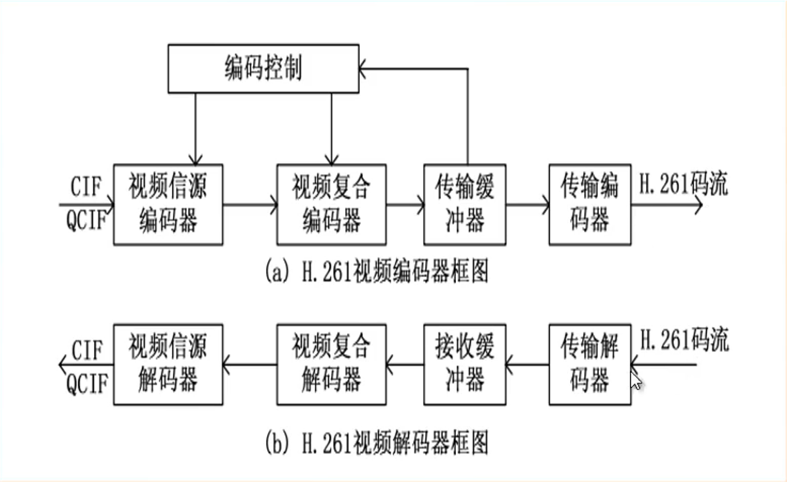
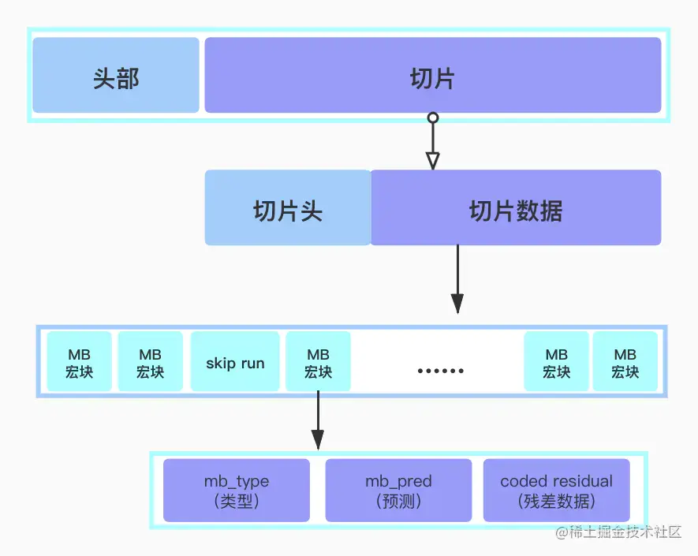
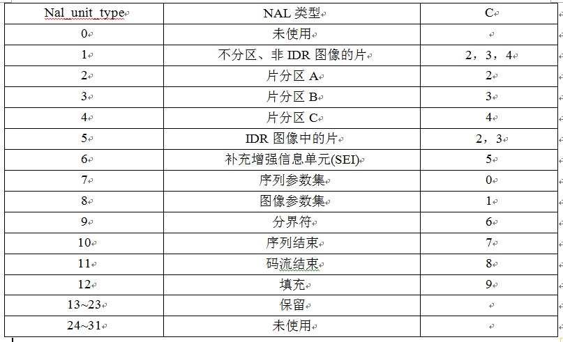

#### RGB与YUV格式对比(H264视频编码01 02)

1. [RGB介绍](https://zhuanlan.zhihu.com/p/350656532)

> 光的三原色(RGB)和色彩的三原色(青色、黄色、洋红)。
> 色彩三原色用于绘画和印刷，运用在白色背景（如白纸）上的。在调颜料时，只需要用青色、洋红、黄色三种颜色就能够调出任何颜色，当将三种颜色的颜料等量混合时，就能得到黑色的颜料
> 光的三原色用于黑色背景(例如屏幕)，我们人眼所看到的任何颜色，都是由这三种颜色的光混合而成的。而白光则是这三种光等量混合在一起产生的。
> RGB占用内存 由于一个字节显示一种颜色所以3字节表示一个像素 ` W*H*3`

2. [YUV格式介绍](https://blog.csdn.net/liufish992/article/details/122234961)

> YUV类似RGB，都能代表颜色，表示颜色。标准定义电视中，Y计算公式为：`Y' = 0.299R + 0.587G + 0.114B`
> 现代电视技术使用了更新的公式，用于高清电视` Y' = 0.2125R + 0.7154G + 0.0721B`
> 公式相关定义可查询ITU-R BT.601
> U和V部分，称为色度值或颜色区分值。由以下公式计算： `U = B - Y' V = R - Y'`
> YUV种类：一般我们用4个像素宽，2个像素高的区域举例。主流的采样方式有三种：
> YUV4:4:4(第一行有4组UV。第二行有另外的4组UV。这也叫做“全采样”。)需要占用的内存：w * h * 3
> YUV4:2:2(第一行有2组UV。第二行有另外2组UV。)需要占用的内存：w * h * 2
> YUV4:2:0(第一行有2组UV。第二行没有自己的UV) 占用内存 `y=w*h u=0.25wh v=0.25 yuv相加等于1.5wh`
>
YUV420是一类格式的集合，YUV420并不能完全确定颜色数据的存储顺序,YUV420根据颜色数据的存储顺序不同，又分为了多种不同的格式，如YUV420Planar、YUV420PackedPlanar、YUV420SemiPlanar和YUV420PackedSemiPlanar，
> YUV420_NV21、YUV420_888是YUV420的子集，他们的yuv数量一样排列不同，第一代camera默认输出NV21
> [YUV存储格式详解，看完就会转ByteArray](https://blog.csdn.net/weekend_y45/article/details/125079916)
> 以防丢失存放在app目录下面(安卓camera2 API获取YUV420_888格式详解_yuv_420_888_周末的音视频的博客-CSDN博客.mhtml) 在浏览器中打开
> YUV420格式又可以细分为YUV420P和YUV420SP两种类型。
> YUV420P是三平面存储，Y、U、V三个分量分别占用一个平面。数据的排列方式有I420，YV12。
> I420，YYYYYYYY UUVV
> YV12，YYYYYYYY VVUU
> YUV420SP是两平面存储，Y分量占用一个平面，UV分量公用一个平面。有两种排列方式NV12、NV21。
> NV12，YYYYYYYY UVUV
> NV21，YYYYYYYY VUVU
> android.media.Image 文档没有说 planes[0] planes[1] planes[2] 代表什么，[代表什么平面是yuv格式决定的][https://developer.android.com/reference/android/graphics/ImageFormat.html#YUV_420_888]
> YUV_420_888文档说的很清楚 planes[0]代表y planes[1]代表u planes[2]代表v
> YuvImage 只支持 NV21 和 YUY2 感觉不行，换

3. H264编码原理

- 帧内编码:把一帧图像划分成若干宏块,宏块只保存了最上面和最左边的像素，中间的数据根据算法预测到的方向填充
- 帧间编码:I帧、B帧、P帧。与I帧相似度达到95%就编码成B帧，相似度70%就编码成P帧。(该说法只出现在涂程老师的课程里面，google没查到)视频第一帧肯定是I帧第二帧肯定是P帧
- GOP图像序列：可以理解成一组图片，图片的物体都是相似的。两个I帧之间是一个GOP，在一个GOP中只有一个I帧
  
- 编码流程:一个视频第一帧肯定编码成I帧，第二帧如果与第一帧相似程度大于95%就编码成B帧，B帧先放在缓冲器中保存不会直接输出进H264码流。
  接下来的帧如果相似程度大于70%小于95%就会编码成P帧直接输出到H264码流中，P帧主要保存的是宏块和运动矢量。保存在缓冲器中的B帧会根据P帧的运动矢量计算出运动矢量的百分比保存在B帧中。
  最后随机(没有按照缓存顺序)输出缓冲器中的B帧到H264码流中，每一帧都是按照播放顺序(时间戳)
  编码的，但是他们的编码顺序却不一样。I帧保存所有宏块信息，P帧保存运动矢量和宏块，B帧就知保存运动矢量。 I帧的编码最简单耗时最短，B帧编码耗时最长。
- 解码流程:第一帧是I帧直接解码后显示，第二帧是P帧解码后刚入缓冲器，之后几帧是B帧，找到I帧与P帧之间时间戳最小的B帧，解码后输出图像，重复这个过程知道B帧都解码完毕。最后再解码缓冲器中的P帧
- 分隔符:pps、sps、以及每一帧(NALU)的开头都以00 00 00 01或者00 00 01开头。如果像素值出现00 00 00 01或者00 00 01为了避免与分隔符冲突这时候就要在连续00 00
  后面插入03 这种做法叫做转义 解码的时候去掉03 如果像素值真的是00 00 03也去掉03. 分隔符后面是帧类型 0X65代表I帧、0X41代表P帧、0X01代表B帧、0X67代表SPS、0X68代表PPS(
  可以简单的这样表示，实际情况看NAL头章节)
- 帧类型：SPS 基础配置帧显示格式宽高。PPS全量配置帧包括纠错单元、优先级顺序、策略信息、编码登记。编码器只会输出一次SPS和PPS，但是H264文件有数个SPS和PPS，这是因为播放本地文件或者直播的时候，
  有可能不是从头开始这时候没有SPS和PPS将无法播放，这就要把SPS和PPS缓存起来等编码器输出I帧的时候手动插入PPS和SPS到H264文件中
- H264数据结构：(H265编码原理详解与码流分析-David\音视频第一节\资料(文档)\文档03-切片)
  
    1. NAL层:（Network Abstraction
       Layer,视频数据网络抽象层）NAL头+切片组成。它的作用是H264只要在网络上传输，在传输的过程每个包以太网是1500字节，而H264的帧往往会大于1500字节，所以要进行拆包，将一个帧拆成多个包进行传输，所有的拆包或者组包都是通过NAL层去处理的。
       **起始码0x 00 00 00 01 或者 0x 00 00 01** 作为**分隔符**。 两个 0x 00 00 00 01之间的字节数据 是表示一个NAL Unit
       1.1 NAL头：第一位 禁止位初始值等于0，等于1表示该单元有错误  
       第二、三位表示优先级，数字越大优先级越高，当解码器忙不过来的时候会有线抛弃优先级0的NALU，B帧的优先级顺序是00，I帧sps和pps优先级顺序是11
       剩余5位表示帧类型
       
       十进制0代表未使用，十进制5代表I帧，十进制7代表sps(序列参数集)，十进制8代表pps(图像参数集)
    2. VCL层:（Video Coding Layer,视频数据编码层） 对视频原始数据进行压缩。EBSP好像等于VCL，文档没有明说涂老师是这样讲的。NALU = NALU Header + EBSP(片) 。
       EBSP相较于RBSP，多了防止竞争的一个字节：0x03。
    3. H264与H265最大区别是宏块大小，H264最大宏块是16X16本来要保存256个像素H264只需要保存31个像素信息，最小宏块4X4本来要保存16个像素信息H264只保存7个像素信息，宏块越大压缩率越高。
       H265最大宏块64X64最小8X8，虽然H265比H265压缩率更大但是算法更复杂，需要性能更强的设备才能流畅播放，实际上是时间换空间
- H265数据结构：(音视频05-H265码流分析.md)
    1. H265需要两个字节表示NAL头：
        - 第一位代表禁止位于H264一致
        - 接下来6位代表帧类型，2^6也就是64种，提取方法(NAL的第一个字节&7E)>>1；7E的二进制0111 1110； 典型的H265码流 VPS-SPS-PPS-I帧 (VPS=32十进制 SPS=33十进制)
        - 接下来6位代表分层ID
        - 接下来3位代表重要性


4. MediaCodec(任何视频流能能解码出完整帧技术)  
   本例在decode包

```agsl
- createByCodeName/createEncoderByType/createDecoderByType: //（静态工厂构造MediaCodec对象）--Uninitialized状态
- configure：（配置） -- configure状态
- start        （启动）--进入Running状态
- while(1) {
    try{
       - dequeueInputBuffer    （从编解码器获取输入缓冲区buffer）
       - queueInputBuffer      （buffer被生成方client填满之后提交给编解码器）
       - dequeueOutputBuffer   （从编解码器获取输出缓冲区buffer）
       - releaseOutputBuffer   （消费方client消费之后释放给编解器）
    } catch(Error e){
       - error                   （出现异常 进入error状态）
    }
    
}
- stop                          （编解码完成后，释放codec）
- release
```  


5. 录屏(record包)  
   [官方文档](https://developer.android.google.cn/guide/topics/large-screens/media-projection)
6. 音视频通话(videocall包)  
   音频录制：采样频率-奈奎斯特采样定理解释了采样率和所测信号频率之间的关系。采样率必须大于信号最高频率的两倍。人耳能听到的声音频率为20Hz-22.05kHz，所以采样率是44100 即一秒内采44100个点
   采样位数:一个点用一个字节(8位)或者两个字节(16位表示)  
   音色:指的是声音的波形  
   通道数:几个通道会录制几个声音，双声道是立体声  
   录制音频使用AudioRecord，得到的PCM是原始音频文件，aac是经过压缩的文件
7. 哥伦布编码(golomb包)  
   sps_pps当做一阵返回 [0, 0, 0, 1, 67, 64, 0, a, ac, b4, 3, c0, 11, 3f, 2c, ac, 14, 18, 14, 1b, 42, 84, d4, 0, 0, 0, 1, 68, ee, 6, f2, c0]
   第0个字节67 是SPS的NAL头
   第一个字节64 是编码等级 十进制profile_idc=66 (Baseline直播) 77 (Main一般场景) 88 (Extended) 100 (High (FRExt)) 110 (High10(FRExt)) 122 (
   High
   4:2:2 (FRExt)) 144 (High 4:4:4 (FRExt))
   第二个字节00 高四位每一位代表一个约束 1要遵守Baseline直播 1要遵守Main一般场景 1要遵守Extended 如果有多个位是1 ，则要遵守多个规范 (具体用处表现在哪里？？？)。低四位 填充位都是0
   第三个字节0a 编码的Level定义了某种条件下的最大视频分辨率、最大视频帧率等参数
   第四个字节ac 从这里开始时哥伦布编码
    - 第一个值是 seq_parameter_set_id 表示当前的序列参数集的id。通过该id值，图像参数集pps可以引用其代表的sps中的参数值范围[0,31],作用不明
    - 第二个值是 chroma_format_idc 的值应该在[0,3]。当不存在时，应推断其值为 1（4：2：0的色度格式）0 单色 1(4:2:0) 2(4:2:2) 3(4:4:4)
    - 第三个值是 bit_depth_luma_minus8 Y色深 0表示8位 1表示10位。 y分量每个用8位表示，例如YUV420_888
    - 第四个值是 bit_depth_chroma_minus8 UV色深 0表示8位 1表示10位
8. 混音(audiomixing包)
   混音实际是两个波形的离散值相加， 范围是 -32767 ~ 32768(两个字节) 相加最大不能超过32768。尤其要注意采样点 是小字节，混音的时候先转换成java的大字节加完再转成小字节
   mediaExtractor.seekTo(startTime, MediaExtractor.SEEK_TO_NEXT_SYNC); 离startTime最近下一个I帧
   调整音量：在值前面乘以1个系数
   不同采样率的音频要转成一致才能合成
   MediaMuxer 混合视频和音频。 要先添加视频轨道再添加音频，pcm太大了还是要编码

